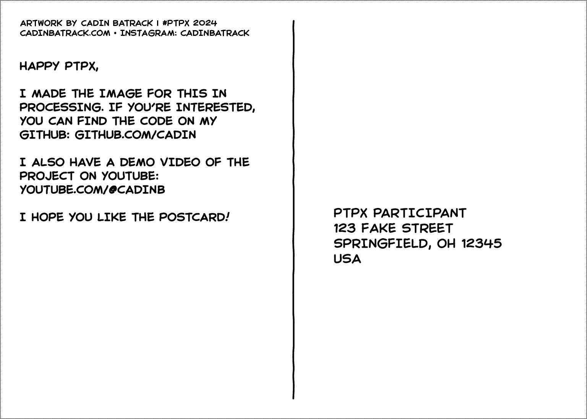

# plotter-postcard

Generate #ptpx postcard back side layouts in Processing.

This projects runs full screen (optional) with a proportional canvas showing your sketch in context of the target print size. Output your postcard as a plot-ready SVG with optional PNG preview.

## Getting Started

### Requirements

-   [Processing 4](https://processing.org/download)

#### Config

Set your paper size, pen thickness, and display scaling in the `config.pde` file.
This is also where you define the text for the caption, message, and address, as well as layout properties like text size, line height, and margins.

The fields in this file should be self-explanatory.

## Usage

After setting your variables in `config.pde`, you just need to run the `app.pde` in Processing and press `s` to save an SVG of your layout.

### Key Commands

**`s`** : Save a plot-ready SVG. This also saves a PNG preview image if you have that flag set in the config file.

By default, this project is set up to save a separate SVG file for each different pen size in your layout. If you want all pen sizes to be in the same SVG, change the `saveLayers` property in `config.pde`

### Modifications

To modify how the sketch itself behaves look at `Sketch.pde`.

This sketch leverages my other projects: [plotter-canvas](https://github.com/cadin/plotter-canvas), [line-wobbler](https://github.com/cadin/line-wobbler), and [plotter-text](https://github.com/cadin/plotter-text).
It may be helpful to check the READMEs for those projects if you want to modify this one.

## Support

This is a personal project and is mostly unsupported, but I'm happy to hear feedback or answer questions.

## License

This project is licensed under the Unlicense - see the [LICENSE](LICENSE) file for details.

---

👨🏻‍🦲❤️🛠
